# Display of the preset Rosetta NCAAs

What exactly are the non-canonical amino acids in the Rosetta database folder?

Names like V02 really do not help... So there is only one way to find out, manually generate a figure for each by recycling a large amount of code.

## Script

The file `generate.py` does the work. To do this, it used both pyrosetta and RDKit. In the case of RDKit the bond order is guessed using a function for a [blog post of mine](https://blog.matteoferla.com/2020/02/guess-bond-order-in-rdkit-by-number-of.html).

In the case of pyrosetta, the mover `pyrosetta.rosetta.protocols.simple_moves.MutateResidue` is used as the argument `new_res` can be a custom parameterised residue. Shamefully, I do not know how one can pass the argument `extra_res_fa` to pyrosetta after it gets initialised as setting it as an option afterward simply failed.

A cool detail is that for once I am not using PyMOL. In fact, the line `pyrosetta.rosetta.core.pose.make_pose_from_sequence(pose, 'A', 'fa_standard')` generates the pose from scratch.

## Gallery

| 3-Letter | File | SMILES | Image |
| --- | --- | --- | --- | --- |
| A34 | 2-aminomethyl-phenylalanine.params | `N[C@@H](Cc1ccccc1C[NH3+])C(=O)[O-]` | 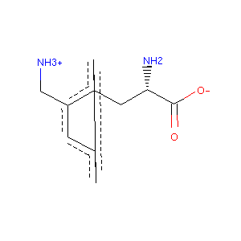 |
| A33 | 2-amino-heptanoic_acid.params | `CCCCC[C@H](N)C(=O)[O-]` | 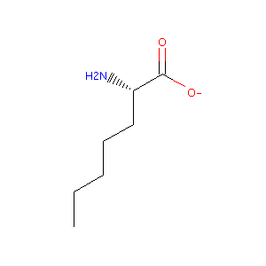 |
| Error | YPN.params | X | (RuntimeError)    File: /Volumes/MacintoshHD3/benchmark/W.fujii.release/rosetta.Fujii.release/_commits_/main/source/src/core/conformation/Residue.cc:1365 [ ERROR ] UtilityExitException ERROR: Unable to fill in missing atoms.   |
| NVL | NVL.params | `CCC[C@H](N)C(=O)[O-]` | 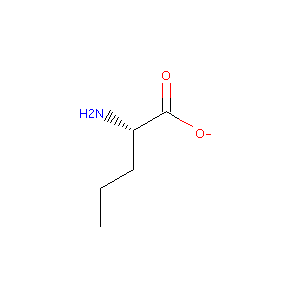 |
| Error | 4J5.params | X | (AttributeError)  'NoneType' object has no attribute 'GetAtoms' |
| C94 | trifluoro-leucine_ent2.params | `CC(C[C@H](N)C(=O)[O-])C(F)(F)F` | 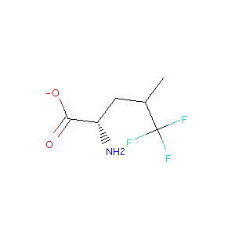 |
| A24 | 2-amino-2-phenylbutyric_acid.params | `CC.N[C@H](C(=O)[O-])c1ccccc1` | 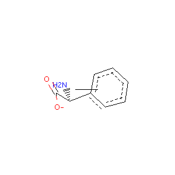 |
| B27 | 4-methyl-phenylalanine.params | `Cc1ccc(cc1)C[C@H](N)C(=O)[O-]` | 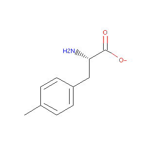 |
| A20 | 2-allyl-glycine.params | `C=CC[C@H](N)C(=O)[O-]` | 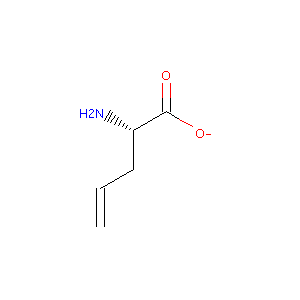 |
| Error | 5-bromo-tryptophan.params | X | (ArgumentError)  Python argument types in     rdkit.Chem.rdmolops.ReplaceSubstructs(NoneType, Mol, Mol) did not match C++ signature:     ReplaceSubstructs(RDKit::ROMol mol, RDKit::ROMol query, RDKit::ROMol replacement, bool replaceAll=False, unsigned int replacementConnectionPoint=0, bool useChirality=False) |
| B57 | alpha-methyl-leucine.params | `CC(C)C.C[C@H](N)C(=O)[O-]` | 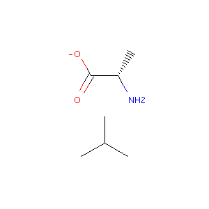 |
| Error | 7-methyl-tryptophan.params | X | (ArgumentError)  Python argument types in     rdkit.Chem.rdmolops.ReplaceSubstructs(NoneType, Mol, Mol) did not match C++ signature:     ReplaceSubstructs(RDKit::ROMol mol, RDKit::ROMol query, RDKit::ROMol replacement, bool replaceAll=False, unsigned int replacementConnectionPoint=0, bool useChirality=False) |
| Error | 4.5-dihydroxy-isoleucine.params | X | (AttributeError)  'NoneType' object has no attribute 'GetAtoms' |
| C26 | homocysteine.params | `N[C@@H](CCS)C(=O)[O-]` | 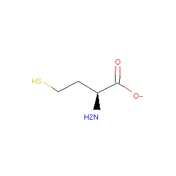 |
| A31 | 2-amino-5-phenyl-pentanoic_acid.params | `N[C@@H](CCCc1ccccc1)C(=O)[O-]` | 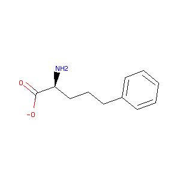 |
| Error | 0TD.params | X | (ArgumentError)  Python argument types in     rdkit.Chem.rdmolops.ReplaceSubstructs(NoneType, Mol, Mol) did not match C++ signature:     ReplaceSubstructs(RDKit::ROMol mol, RDKit::ROMol query, RDKit::ROMol replacement, bool replaceAll=False, unsigned int replacementConnectionPoint=0, bool useChirality=False) |
| Error | 4-amino-tetrahydrothiopyran-4-carboxylic_acid.params | X | (AttributeError)  'NoneType' object has no attribute 'GetAtoms' |
| B97 | beta-chloro-alanine.params | `N[C@@H](CCl)C(=O)[O-]` | 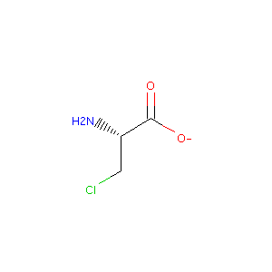 |
| B58 | alpha-methyl-phenylalanine.params | `C[C@H](N)C(=O)[O-].Cc1ccccc1` | 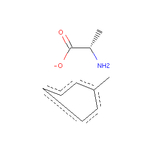 |
| V02 | V02.params | `N[C@H](C(=O)[O-])c1ccc(O)cc1` | 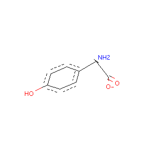 |
| B19 | 4-fluoro-proline.params_rot | `CC(F)C[C@H](N)C(=O)[O-]` | 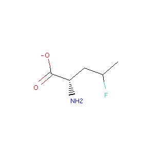 |
| C00 | beta-cyclohexyl-alanine.params | `N[C@@H](CC1CCCCC1)C(=O)[O-]` | 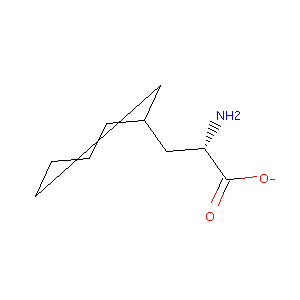 |
| Error | 4-fluoro-tryptophan.params | X | (ArgumentError)  Python argument types in     rdkit.Chem.rdmolops.ReplaceSubstructs(NoneType, Mol, Mol) did not match C++ signature:     ReplaceSubstructs(RDKit::ROMol mol, RDKit::ROMol query, RDKit::ROMol replacement, bool replaceAll=False, unsigned int replacementConnectionPoint=0, bool useChirality=False) |
| A80 | 3-hydroxy-tyrosine.params | `N[C@@H](Cc1ccc(O)c(O)c1)C(=O)[O-]` | 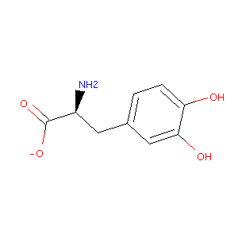 |
| NLU | NLU.params | `CCCC[C@H](N)C(=O)[O-]` | 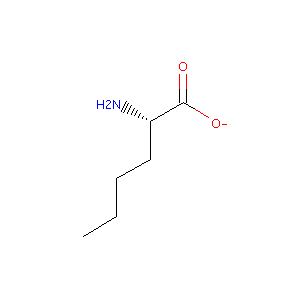 |
| Error | 5-hydroxy-tryptophan.params | X | (ArgumentError)  Python argument types in     rdkit.Chem.rdmolops.ReplaceSubstructs(NoneType, Mol, Mol) did not match C++ signature:     ReplaceSubstructs(RDKit::ROMol mol, RDKit::ROMol query, RDKit::ROMol replacement, bool replaceAll=False, unsigned int replacementConnectionPoint=0, bool useChirality=False) |
| B96 | beta.beta-diphenyl-alanine.params | `N[C@H](C(=O)[O-])C(c1ccccc1)c1ccccc1` | 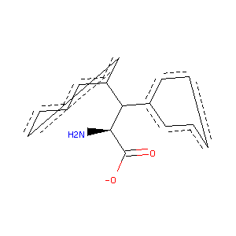 |
| C27 | homophenylalanine.params | `N[C@@H](CCc1ccccc1)C(=O)[O-]` | 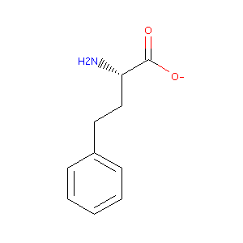 |
| B54 | alpha-methyl-3-hydroxy-tyrosine.params | `C[C@H](N)C(=O)[O-].Cc1ccc(O)c(O)c1` | 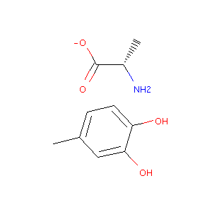 |
| C30 | homoserine.params | `N[C@@H](CCO)C(=O)[O-]` | 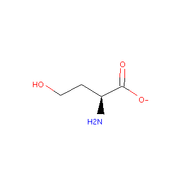 |
| B61 | alpha-methyl-tyrosine.params | `C[C@H](N)C(=O)[O-].Cc1ccc(O)cc1` | 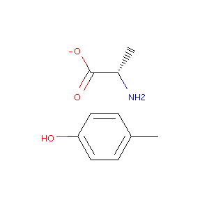 |
| BMAA | 2-amino-3-methylamino-propanoic_acid.params | `C[NH2+]C[C@H](N)C(=O)[O-]` | 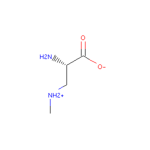 |
| C04 | beta-hydroxy-norvaline.params | `CCC(O)[C@H](N)C(=O)[O-]` | 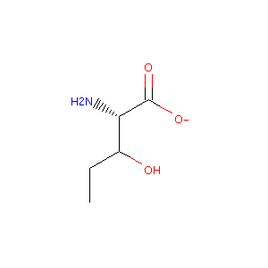 |
| Error | HIP.params | X | (ValueError)  causes seg fault |
| Error | 3-methyl-histidine.params | X | (ArgumentError)  Python argument types in     rdkit.Chem.rdmolops.ReplaceSubstructs(NoneType, Mol, Mol) did not match C++ signature:     ReplaceSubstructs(RDKit::ROMol mol, RDKit::ROMol query, RDKit::ROMol replacement, bool replaceAll=False, unsigned int replacementConnectionPoint=0, bool useChirality=False) |
| A30 | 2-amino-4-bromo-4-pentenoic_acid.params | `C=C(Br)C[C@H](N)C(=O)[O-]` | 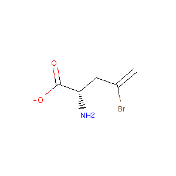 |
| V04 | V04.params | `N[C@H](C(=O)[O-])C(O)c1ccc(O)c(Cl)c1` | 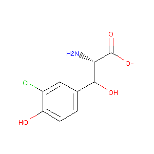 |
| Error | 5-fluoro-tryptophan.params | X | (ArgumentError)  Python argument types in     rdkit.Chem.rdmolops.ReplaceSubstructs(NoneType, Mol, Mol) did not match C++ signature:     ReplaceSubstructs(RDKit::ROMol mol, RDKit::ROMol query, RDKit::ROMol replacement, bool replaceAll=False, unsigned int replacementConnectionPoint=0, bool useChirality=False) |
| DAB | 2.4-diaminobutyric_acid.params | `N[C@@H](CC[NH3+])C(=O)[O-]` | 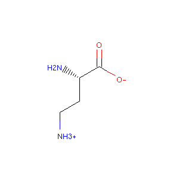 |
| C89 | 4-fluoro-proline_puck.params_rot | `CC(F)C[C@H](N)C(=O)[O-]` | 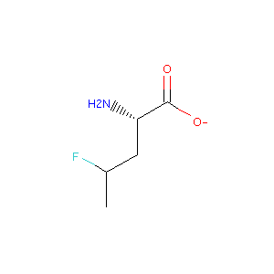 |
| HLU | HLU.params | `CC(C)CC[C@H](N)C(=O)[O-]` | 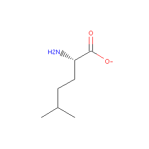 |
| A32 | 2-amino-octanoic_acid.params | `CCCCCC[C@H](N)C(=O)[O-]` | 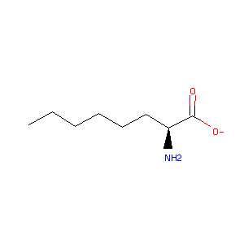 |
| B50 | alpha-amino-glycine.params | `NC([NH3+])C=O` | 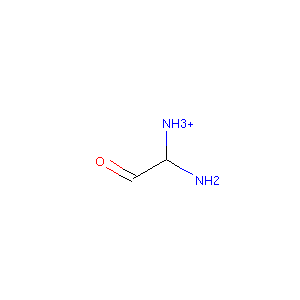 |
| B95 | beta-beta-dicyclohexyl-alanine.params | `N[C@H](C(=O)[O-])C(C1CCCCC1)C1CCCCC1` |  |
| A43 | 2-hydroxy-phenylalanine.params | `N[C@@H](Cc1ccccc1O)C(=O)[O-]` | 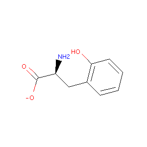 |
| Error | S56.params | X | (ArgumentError)  Python argument types in     rdkit.Chem.rdmolops.ReplaceSubstructs(NoneType, Mol, Mol) did not match C++ signature:     ReplaceSubstructs(RDKit::ROMol mol, RDKit::ROMol query, RDKit::ROMol replacement, bool replaceAll=False, unsigned int replacementConnectionPoint=0, bool useChirality=False) |
| C93 | hexafluoro-leucine.params | `N[C@@H](CC(C(F)(F)F)C(F)(F)F)C(=O)[O-]` | 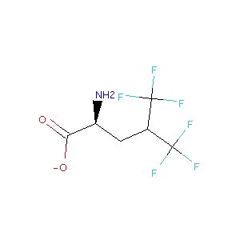 |
| C20 | ethionine.params | `CCSCC[C@H](N)C(=O)[O-]` | 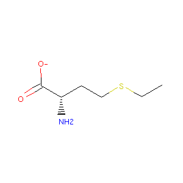 |
| B74 | beta-(2-naphthyl)-alanine.params | `N[C@@H](Cc1ccc2ccccc2c1)C(=O)[O-]` | 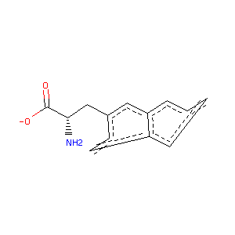 |
| C55 | tert-butyl-glycine.params | `CC(C)(C)[C@H](N)C(=O)[O-]` | 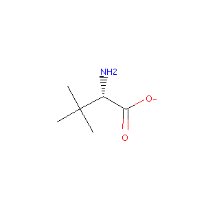 |
| B44 | 9-anthryl-alanine.params | `N[C@@H](Cc1c2ccccc2cc2ccccc12)C(=O)[O-]` | 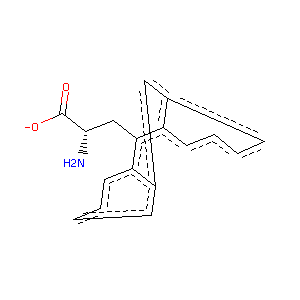 |
| Error | 6-chloro-tryptophan.params | X | (ArgumentError)  Python argument types in     rdkit.Chem.rdmolops.ReplaceSubstructs(NoneType, Mol, Mol) did not match C++ signature:     ReplaceSubstructs(RDKit::ROMol mol, RDKit::ROMol query, RDKit::ROMol replacement, bool replaceAll=False, unsigned int replacementConnectionPoint=0, bool useChirality=False) |
| C92 | fluoro-leucine_ent2.params | `CC(CF)C[C@H](N)C(=O)[O-]` | 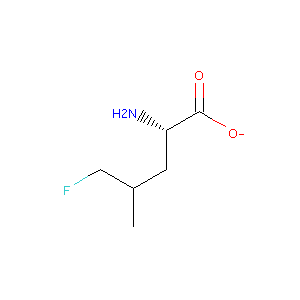 |
| B62 | alpha-methyl-valine.params | `CCC.C[C@H](N)C(=O)[O-]` |  |
| C41 | penicillamine.params | `CC(C)(S)[C@H](N)C(=O)[O-]` | 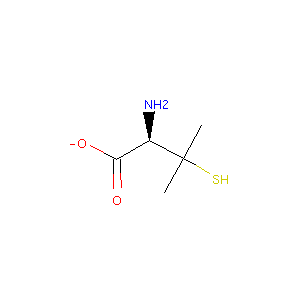 |
| ABA | ABA.params | `CC[C@H](N)C(=O)[O-]` | 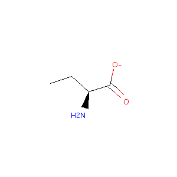 |
| Error | 4-phenyl-phenylalanine_tyr_rot.params | X | (ArgumentError)  Python argument types in     rdkit.Chem.rdmolops.ReplaceSubstructs(NoneType, Mol, Mol) did not match C++ signature:     ReplaceSubstructs(RDKit::ROMol mol, RDKit::ROMol query, RDKit::ROMol replacement, bool replaceAll=False, unsigned int replacementConnectionPoint=0, bool useChirality=False) |
| A98 | 4-amino-piperidine-4-carboxylic-acid.params | `CC[NH2+]CC[C@H](N)C(=O)[O-]` | 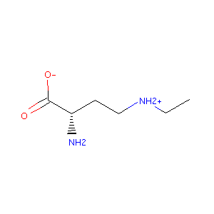 |
| A83 | 3-methyl-histidine_prot.params | `CN1CNC=C1C[C@H](N)C(=O)[O-]` | 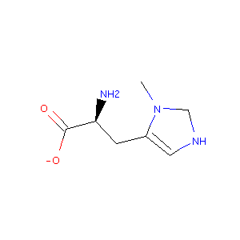 |
| B59 | alpha-methyl-proline.params | `CCC.C[C@H](N)C(=O)[O-]` | 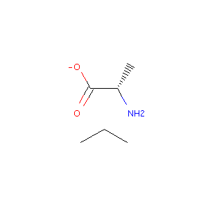 |
| B56 | alpha-methyl-histidine.params | `C[C@H](N)C(=O)[O-].Cc1c[nH]cn1` | 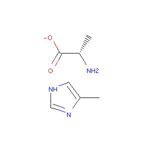 |
| A45 | 2-indanyl-glycine_puck2.params | `N[C@H](C(=O)[O-])C1Cc2ccccc2C1` | 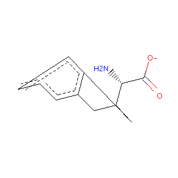 |
| Error | MPH.params | X | (RuntimeError)    File: /Volumes/MacintoshHD3/benchmark/W.fujii.release/rosetta.Fujii.release/_commits_/main/source/src/core/conformation/Residue.cc:1365 [ ERROR ] UtilityExitException ERROR: Unable to fill in missing atoms.   |
| C15 | diphenylglycine.params | `N[C@H](C(=O)[O-])c1ccccc1.c1ccccc1` | 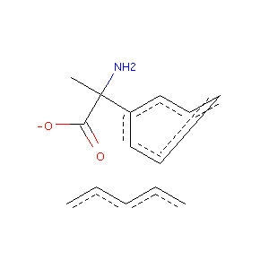 |
| Error | 6-methyl-tryptophan.params | X | (ArgumentError)  Python argument types in     rdkit.Chem.rdmolops.ReplaceSubstructs(NoneType, Mol, Mol) did not match C++ signature:     ReplaceSubstructs(RDKit::ROMol mol, RDKit::ROMol query, RDKit::ROMol replacement, bool replaceAll=False, unsigned int replacementConnectionPoint=0, bool useChirality=False) |
| Error | 6-bromo-tryptophan.params | X | (ArgumentError)  Python argument types in     rdkit.Chem.rdmolops.ReplaceSubstructs(NoneType, Mol, Mol) did not match C++ signature:     ReplaceSubstructs(RDKit::ROMol mol, RDKit::ROMol query, RDKit::ROMol replacement, bool replaceAll=False, unsigned int replacementConnectionPoint=0, bool useChirality=False) |
| BB8 | phenyl-serine.params | `N[C@H](C(=O)[O-])C(O)c1ccccc1` | 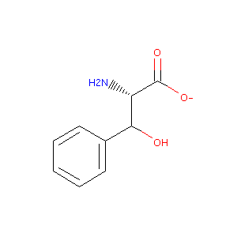 |
| Error | 7-azatryptophan.params | X | (ArgumentError)  Python argument types in     rdkit.Chem.rdmolops.ReplaceSubstructs(NoneType, Mol, Mol) did not match C++ signature:     ReplaceSubstructs(RDKit::ROMol mol, RDKit::ROMol query, RDKit::ROMol replacement, bool replaceAll=False, unsigned int replacementConnectionPoint=0, bool useChirality=False) |
| C54 | tert-butyl-cysteine.params | `CC(C)(C)SC[C@H](N)C(=O)[O-]` | 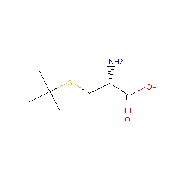 |
| V03 | V03.params | `N[C@H](C(=O)[O-])c1cc(O)cc(O)c1` | 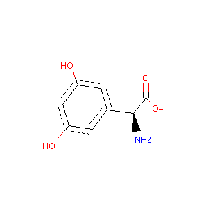 |
| MPA | MPA.params | `Cc1ccc(cc1)C[C@H](N)C(=O)[O-]` | 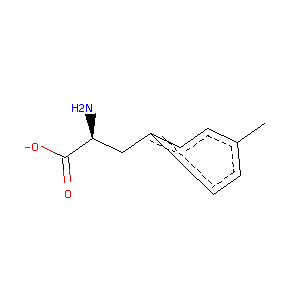 |
| TES | TES.params | `CC(=O)NC1C(NC(=O)C[C@H](N)C(=O)[O-])OC(CO)C(OC2OC(CO)C(OC3OC(COC4OC(COC5OC(CO)C(O)C(O)C5O)C(O)C(OC5OC(CO)C(O)C(O)C5O)C4O)C(O)C(OC4OC(CO)C(O)C(O)C4O)C3O)C(O)C2NC(C)=O)C1O` |  |
| C89 | 4-fluoro-proline_puck.params | `CC(F)C[C@H](N)C(=O)[O-]` |  |
| C53 | tert-butyl-alanine.params | `CC(C)(C)C[C@H](N)C(=O)[O-]` |  |
| A06 | 1-methyl-histidine.params | `Cn1cnc(c1)C[C@H](N)C(=O)[O-]` |  |
| A69 | 3-amino-tyrosine.params | `Nc1cc(ccc1O)C[C@H](N)C(=O)[O-]` |  |
| HTY | HTY.params | `N[C@@H](Cc1ccc(O)cc1O)C(=O)[O-]` |  |
| B02 | 4-amino-tetrahydropyran-4-carboxylic_acid.params | `CCOCC[C@H](N)C(=O)[O-]` |  |
| Error | alpha-methyl-tryptophan.params | X | (ArgumentError)  Python argument types in     rdkit.Chem.rdmolops.ReplaceSubstructs(NoneType, Mol, Mol) did not match C++ signature:     ReplaceSubstructs(RDKit::ROMol mol, RDKit::ROMol query, RDKit::ROMol replacement, bool replaceAll=False, unsigned int replacementConnectionPoint=0, bool useChirality=False) |
| HPR | HPR.params | `CC(O)C[C@H](N)C(=O)[O-]` |  |
| Error | 4-methyl-tryptophan.params | X | (ArgumentError)  Python argument types in     rdkit.Chem.rdmolops.ReplaceSubstructs(NoneType, Mol, Mol) did not match C++ signature:     ReplaceSubstructs(RDKit::ROMol mol, RDKit::ROMol query, RDKit::ROMol replacement, bool replaceAll=False, unsigned int replacementConnectionPoint=0, bool useChirality=False) |
| C60 | trifluoro-alanine.params | `N[C@H](C(=O)[O-])C(F)(F)F` |  |
| C01 | beta-cyclopentyl-alanine.params | `N[C@@H](CC1CCCC1)C(=O)[O-]` |  |
| A12 | 2.4-dimethyl-phenylalanine.params | `Cc1ccc(C[C@H](N)C(=O)[O-])c(C)c1` |  |
| A07 | 1-methyl-histidine_prot.params | `CN1C=C(C[C@H](N)C(=O)[O-])NC1` |  |
| Error | MTP.params | X | (ArgumentError)  Python argument types in     rdkit.Chem.rdmolops.ReplaceSubstructs(NoneType, Mol, Mol) did not match C++ signature:     ReplaceSubstructs(RDKit::ROMol mol, RDKit::ROMol query, RDKit::ROMol replacement, bool replaceAll=False, unsigned int replacementConnectionPoint=0, bool useChirality=False) |
| A68 | 3-aminomethyl-phenylalanine.params | `N[C@@H](Cc1cccc(c1)C[NH3+])C(=O)[O-]` |  |
| V01 | V01.params | `N[C@H](C(=O)[O-])C(O)c1ccc(O)c(Cl)c1` |  |
| C12 | cyclohexyl-glycine.params | `N[C@H](C(=O)[O-])C1CCCCC1` |  |
| A84 | 3-methyl-phenylalanine.params | `Cc1cccc(c1)C[C@H](N)C(=O)[O-]` |  |
| C61 | trifluoro-leucine.params | `CC(C[C@H](N)C(=O)[O-])C(F)(F)F` |  |
| BCS | BCS.params | `N[C@@H](CSCc1ccccc1)C(=O)[O-]` |  |
| A78 | 3-hydroxy-phenylalanine.params | `N[C@@H](Cc1cccc(O)c1)C(=O)[O-]` |  |
| C95 | 3-chloro-phenylalanine.params | `N[C@@H](Cc1cccc(Cl)c1)C(=O)[O-]` |  |
| A91 | 4.5-dehydro-leucine.params | `C=C(C)C[C@H](N)C(=O)[O-]` |  |
| Error | alpha-aminoadipic_acid.params | X | (ArgumentError)  Python argument types in     rdkit.Chem.rdmolops.ReplaceSubstructs(NoneType, Mol, Mol) did not match C++ signature:     ReplaceSubstructs(RDKit::ROMol mol, RDKit::ROMol query, RDKit::ROMol replacement, bool replaceAll=False, unsigned int replacementConnectionPoint=0, bool useChirality=False) |
| Error | 7-bromo-tryptophan.params | X | (ArgumentError)  Python argument types in     rdkit.Chem.rdmolops.ReplaceSubstructs(NoneType, Mol, Mol) did not match C++ signature:     ReplaceSubstructs(RDKit::ROMol mol, RDKit::ROMol query, RDKit::ROMol replacement, bool replaceAll=False, unsigned int replacementConnectionPoint=0, bool useChirality=False) |
| B63 | amino-ethyl-cysteine.params | `N[C@@H](CSCC[NH3+])C(=O)[O-]` |  |
| B19 | 4-fluoro-proline.params | `CC(F)C[C@H](N)C(=O)[O-]` |  |
| C03 | beta-fluoro-alanine.params | `N[C@@H](CF)C(=O)[O-]` |  |
| C91 | fluoro-leucine_ent1.params | `CC(CF)C[C@H](N)C(=O)[O-]` |  |
| A94 | 4-aminomethyl-phenylalanine.params | `N[C@@H](Cc1ccc(cc1)C[NH3+])C(=O)[O-]` |  |
| ORN | ornithine.params | `N[C@@H](CCC[NH2+])C(=O)[O-]` |  |
| Error | 5-methyl-tryptophan.params | X | (ArgumentError)  Python argument types in     rdkit.Chem.rdmolops.ReplaceSubstructs(NoneType, Mol, Mol) did not match C++ signature:     ReplaceSubstructs(RDKit::ROMol mol, RDKit::ROMol query, RDKit::ROMol replacement, bool replaceAll=False, unsigned int replacementConnectionPoint=0, bool useChirality=False) |
| Error | 5-chloro-tryptophan.params | X | (ArgumentError)  Python argument types in     rdkit.Chem.rdmolops.ReplaceSubstructs(NoneType, Mol, Mol) did not match C++ signature:     ReplaceSubstructs(RDKit::ROMol mol, RDKit::ROMol query, RDKit::ROMol replacement, bool replaceAll=False, unsigned int replacementConnectionPoint=0, bool useChirality=False) |
| Error | HP2.params | X | (ValueError)  causes seg fault |
| Error | 4-phenyl-phenylalanine.params | X | (ArgumentError)  Python argument types in     rdkit.Chem.rdmolops.ReplaceSubstructs(NoneType, Mol, Mol) did not match C++ signature:     ReplaceSubstructs(RDKit::ROMol mol, RDKit::ROMol query, RDKit::ROMol replacement, bool replaceAll=False, unsigned int replacementConnectionPoint=0, bool useChirality=False) |
| B21 | 4-hydroxy-phenylglycine.params | `N[C@H](C(=O)[O-])c1ccc(O)cc1` |  |
| DPP | 2.3-diaminopropionic_acid.params | `N[C@@H](C[NH3+])C(=O)[O-]` |  |
| IGL | 2-indanyl-glycine_puck1.params | `N[C@H](C(=O)[O-])C1Cc2ccccc2C1` |  |
| C05 | beta-iodo-alanine.params | `N[C@@H](CI)C(=O)[O-]` |  |
| A04 | 1-amino-cyclopentane-carboxylic_acid.params | `CCCC[C@H](N)C(=O)[O-]` |  |
| A92 | 4.5-dehydro-lysine.params | `N[C@@H](CC=CC[NH3+])C(=O)[O-]` |  |
| A48 | 2-methyl-phenylalanine.params | `Cc1ccccc1C[C@H](N)C(=O)[O-]` |  |
| Error | SAL.params | X | (RuntimeError)    File: /Volumes/MacintoshHD3/benchmark/W.fujii.release/rosetta.Fujii.release/_commits_/main/source/src/core/conformation/Residue.cc:200 [ ERROR ] UtilityExitException ERROR:    |
| B67 | beta-(1-naphthyl)-alanine.params | `N[C@@H](Cc1cccc2ccccc12)C(=O)[O-]` |  |
| C42 | phenylglycine.params | `N[C@H](C(=O)[O-])c1ccccc1` |  |
| B31 | 4-tert-butyl-phenylalanine.params | `CC(C)(C)c1ccc(cc1)C[C@H](N)C(=O)[O-]` |  |
| APA | APA.params | `Nc1ccc(cc1)C[C@H](N)C(=O)[O-]` |  |
| Error | 6-fluoro-tryptophan.params | X | (ArgumentError)  Python argument types in     rdkit.Chem.rdmolops.ReplaceSubstructs(NoneType, Mol, Mol) did not match C++ signature:     ReplaceSubstructs(RDKit::ROMol mol, RDKit::ROMol query, RDKit::ROMol replacement, bool replaceAll=False, unsigned int replacementConnectionPoint=0, bool useChirality=False) |
| Error | 4-carboxy-phenylalanine.params | X | (ArgumentError)  Python argument types in     rdkit.Chem.rdmolops.ReplaceSubstructs(NoneType, Mol, Mol) did not match C++ signature:     ReplaceSubstructs(RDKit::ROMol mol, RDKit::ROMol query, RDKit::ROMol replacement, bool replaceAll=False, unsigned int replacementConnectionPoint=0, bool useChirality=False) |
| Error | BZP.params | X | (ArgumentError)  Python argument types in     rdkit.Chem.rdmolops.ReplaceSubstructs(NoneType, Mol, Mol) did not match C++ signature:     ReplaceSubstructs(RDKit::ROMol mol, RDKit::ROMol query, RDKit::ROMol replacement, bool replaceAll=False, unsigned int replacementConnectionPoint=0, bool useChirality=False) |
| Error | n-in-methyl-tryptophan.params | X | (ArgumentError)  Python argument types in     rdkit.Chem.rdmolops.ReplaceSubstructs(NoneType, Mol, Mol) did not match C++ signature:     ReplaceSubstructs(RDKit::ROMol mol, RDKit::ROMol query, RDKit::ROMol replacement, bool replaceAll=False, unsigned int replacementConnectionPoint=0, bool useChirality=False) |
| C16 | dipropyl-glycine.params | `CCC.CCC[C@H](N)C(=O)[O-]` |  |