# Display of the preset Rosetta NCAAs

What exactly are the non-canonical amino acids in the Rosetta database folder?

Names like V02 really do not help... So there is only one way to find out, manually generate a figure for each by recycling a large amount of code.

## Script

The file `generate.py` does the work. To do this, it used both pyrosetta and RDKit. In the case of RDKit the bond order is guessed using a function for a [blog post of mine](https://blog.matteoferla.com/2020/02/guess-bond-order-in-rdkit-by-number-of.html).

In the case of pyrosetta, the mover `pyrosetta.rosetta.protocols.simple_moves.MutateResidue` is used as the argument `new_res` can be a custom parameterised residue. Shamefully, I do not know how one can pass the argument `extra_res_fa` to pyrosetta after it gets initialised as setting it as an option afterward simply failed.

A cool detail is that for once I am not using PyMOL. In fact, the line `pyrosetta.rosetta.core.pose.make_pose_from_sequence(pose, 'A', 'fa_standard')` generates the pose from scratch.

The `fix_bond_order` method has a problem with tryptophans due to a valence of 5 carbon. Makes sense though.

## Gallery

<table>
<thead>
<tr>
<th>3-Letter</th>
<th>&nbsp;Image&nbsp;of&nbsp;non-canonical&nbsp;amino&nbsp;acid</th>
<th>File</th>
<th>SMILES</th>
</tr>
</thead>
<tbody>
<tr><td style=>A34</td><td>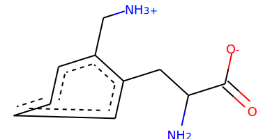 </td><td>2-aminomethyl-phenylalanine.params</td><td><code>N[C@@H](Cc1ccccc1C[NH3+])C(=O)[O-]</code></td></tr>
<tr><td style=>A33</td><td>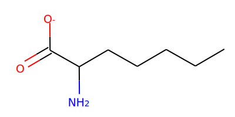 </td><td>2-amino-heptanoic_acid.params</td><td><code>CCCCC[C@H](N)C(=O)[O-]</code></td></tr>
<tr><td> Error </td><td> X </td><td> YPN.params </td><td> (RuntimeError)    File: /Volumes/MacintoshHD3/benchmark/W.fujii.release/rosetta.Fujii.release/_commits_/main/source/src/core/conformation/Residue.cc:1365 [ ERROR ] UtilityExitException ERROR: Unable to fill in missing atoms.   </td></tr>
<tr><td style=>NVL</td><td>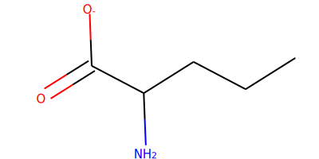 </td><td>NVL.params</td><td><code>CCC[C@H](N)C(=O)[O-]</code></td></tr>
<tr><td> Error </td><td> X </td><td> 4J5.params </td><td> (ValueError)  Generated PDB is not loadable by RDKit. </td></tr>
<tr><td style=>C94</td><td>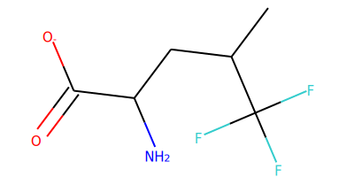 </td><td>trifluoro-leucine_ent2.params</td><td><code>CC(C[C@H](N)C(=O)[O-])C(F)(F)F</code></td></tr>
<tr><td> Error </td><td> X </td><td> 2-amino-2-phenylbutyric_acid.params </td><td> (KekulizeException)  Can't kekulize mol.  Unkekulized atoms: 0 1 2 3 4  </td></tr>
<tr><td style=>B27</td><td>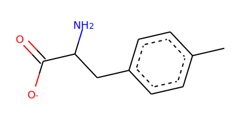 </td><td>4-methyl-phenylalanine.params</td><td><code>Cc1ccc(C[C@H](N)C(=O)[O-])cc1</code></td></tr>
<tr><td style=>A20</td><td>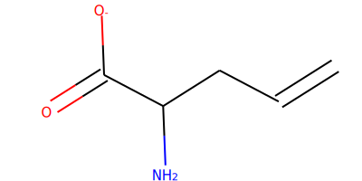 </td><td>2-allyl-glycine.params</td><td><code>C=CC[C@H](N)C(=O)[O-]</code></td></tr>
<tr><td> Error </td><td> X </td><td> 5-bromo-tryptophan.params </td><td> (MolSanitizeException)  Explicit valence for atom # 5 C, 5, is greater than permitted </td></tr>
<tr><td style=>B57</td><td>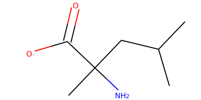 </td><td>alpha-methyl-leucine.params</td><td><code>CC(C)C.C[C@H](N)C(=O)[O-]</code></td></tr>
<tr><td> Error </td><td> X </td><td> 7-methyl-tryptophan.params </td><td> (MolSanitizeException)  Explicit valence for atom # 5 C, 5, is greater than permitted </td></tr>
<tr><td> Error </td><td> X </td><td> 4.5-dihydroxy-isoleucine.params </td><td> (ValueError)  Generated PDB is not loadable by RDKit. </td></tr>
<tr><td style=>C26</td><td>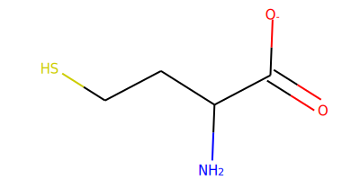 </td><td>homocysteine.params</td><td><code>N[C@@H](CCS)C(=O)[O-]</code></td></tr>
<tr><td style=>A31</td><td>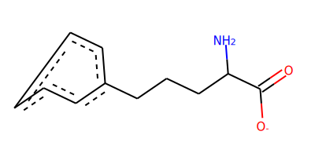 </td><td>2-amino-5-phenyl-pentanoic_acid.params</td><td><code>N[C@@H](CCCc1ccccc1)C(=O)[O-]</code></td></tr>
<tr><td> Error </td><td> X </td><td> 0TD.params </td><td> (MolSanitizeException)  Explicit valence for atom # 6 C, 5, is greater than permitted </td></tr>
<tr><td> Error </td><td> X </td><td> 4-amino-tetrahydrothiopyran-4-carboxylic_acid.params </td><td> (ValueError)  Generated PDB is not loadable by RDKit. </td></tr>
<tr><td style=>B97</td><td>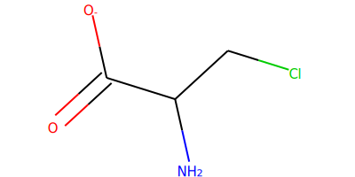 </td><td>beta-chloro-alanine.params</td><td><code>N[C@@H](CCl)C(=O)[O-]</code></td></tr>
<tr><td style=>B58</td><td>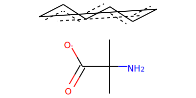 </td><td>alpha-methyl-phenylalanine.params</td><td><code>C[C@H](N)C(=O)[O-].Cc1ccccc1</code></td></tr>
<tr><td> Error </td><td> X </td><td> V02.params </td><td> (KekulizeException)  Can't kekulize mol.  Unkekulized atoms: 0 1 2 4 5  </td></tr>
<tr><td style=>B19</td><td> </td><td>4-fluoro-proline.params_rot</td><td><code>CC(F)C[C@H](N)C(=O)[O-]</code></td></tr>
<tr><td style=>C00</td><td>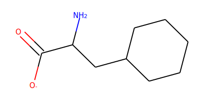 </td><td>beta-cyclohexyl-alanine.params</td><td><code>N[C@@H](CC1CCCCC1)C(=O)[O-]</code></td></tr>
<tr><td> Error </td><td> X </td><td> 4-fluoro-tryptophan.params </td><td> (MolSanitizeException)  Explicit valence for atom # 5 C, 5, is greater than permitted </td></tr>
<tr><td style=>A80</td><td>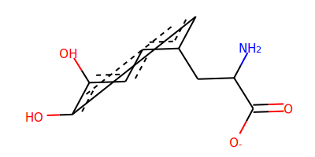 </td><td>3-hydroxy-tyrosine.params</td><td><code>N[C@@H](Cc1ccc(O)c(O)c1)C(=O)[O-]</code></td></tr>
<tr><td style=>NLU</td><td>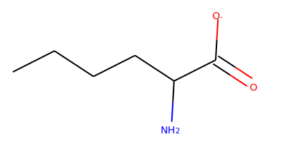 </td><td>NLU.params</td><td><code>CCCC[C@H](N)C(=O)[O-]</code></td></tr>
<tr><td> Error </td><td> X </td><td> 5-hydroxy-tryptophan.params </td><td> (MolSanitizeException)  Explicit valence for atom # 5 C, 5, is greater than permitted </td></tr>
<tr><td style=>B96</td><td>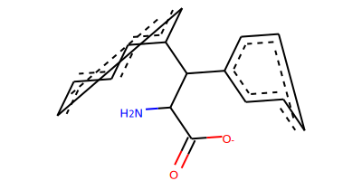 </td><td>beta.beta-diphenyl-alanine.params</td><td><code>N[C@H](C(=O)[O-])C(c1ccccc1)c1ccccc1</code></td></tr>
<tr><td style=>C27</td><td>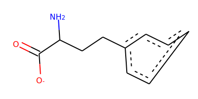 </td><td>homophenylalanine.params</td><td><code>N[C@@H](CCc1ccccc1)C(=O)[O-]</code></td></tr>
<tr><td style=>B54</td><td>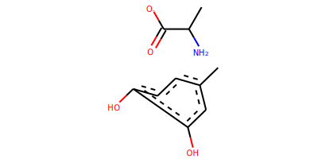 </td><td>alpha-methyl-3-hydroxy-tyrosine.params</td><td><code>C[C@H](N)C(=O)[O-].Cc1ccc(O)c(O)c1</code></td></tr>
<tr><td style=>C30</td><td>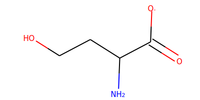 </td><td>homoserine.params</td><td><code>N[C@@H](CCO)C(=O)[O-]</code></td></tr>
<tr><td style=>B61</td><td>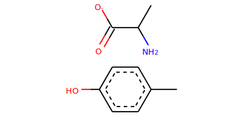 </td><td>alpha-methyl-tyrosine.params</td><td><code>C[C@H](N)C(=O)[O-].Cc1ccc(O)cc1</code></td></tr>
<tr><td style=>BMAA</td><td>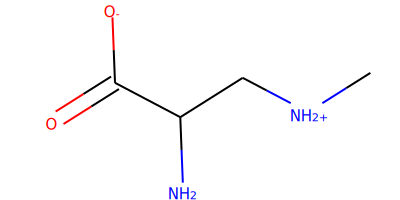 </td><td>2-amino-3-methylamino-propanoic_acid.params</td><td><code>C[NH2+]C[C@H](N)C(=O)[O-]</code></td></tr>
<tr><td style=>C04</td><td>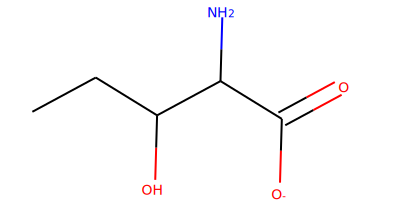 </td><td>beta-hydroxy-norvaline.params</td><td><code>CCC(O)[C@H](N)C(=O)[O-]</code></td></tr>
<tr><td> Error </td><td> X </td><td> HIP.params </td><td> (ValueError)  causes seg fault </td></tr>
<tr><td> Error </td><td> X </td><td> 3-methyl-histidine.params </td><td> (MolSanitizeException)  Explicit valence for atom # 8 N, 4, is greater than permitted </td></tr>
<tr><td style=>A30</td><td>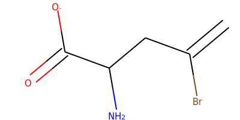 </td><td>2-amino-4-bromo-4-pentenoic_acid.params</td><td><code>C=C(Br)C[C@H](N)C(=O)[O-]</code></td></tr>
<tr><td style=>V04</td><td>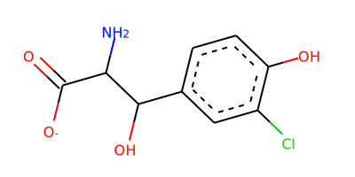 </td><td>V04.params</td><td><code>N[C@H](C(=O)[O-])C(O)c1ccc(O)c(Cl)c1</code></td></tr>
<tr><td> Error </td><td> X </td><td> 5-fluoro-tryptophan.params </td><td> (MolSanitizeException)  Explicit valence for atom # 5 C, 5, is greater than permitted </td></tr>
<tr><td style=>DAB</td><td>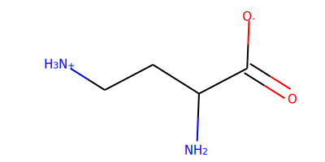 </td><td>2.4-diaminobutyric_acid.params</td><td><code>N[C@@H](CC[NH3+])C(=O)[O-]</code></td></tr>
<tr><td style=>C89</td><td>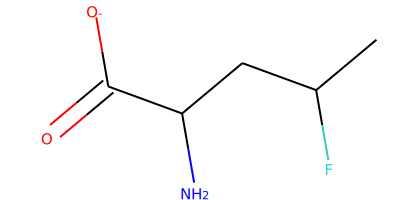 </td><td>4-fluoro-proline_puck.params_rot</td><td><code>CC(F)C[C@H](N)C(=O)[O-]</code></td></tr>
<tr><td style=>HLU</td><td>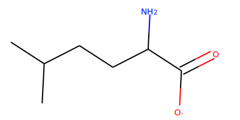 </td><td>HLU.params</td><td><code>CC(C)CC[C@H](N)C(=O)[O-]</code></td></tr>
<tr><td style=>A32</td><td>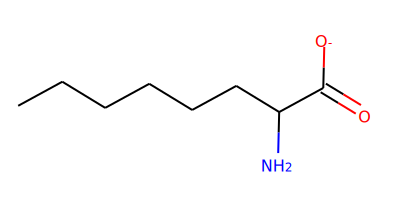 </td><td>2-amino-octanoic_acid.params</td><td><code>CCCCCC[C@H](N)C(=O)[O-]</code></td></tr>
<tr><td style=>B50</td><td>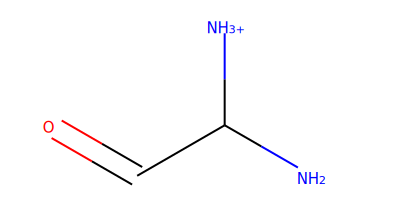 </td><td>alpha-amino-glycine.params</td><td><code>NC([NH3+])C=O</code></td></tr>
<tr><td style=>B95</td><td>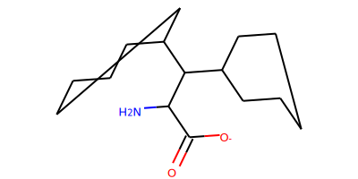 </td><td>beta-beta-dicyclohexyl-alanine.params</td><td><code>N[C@H](C(=O)[O-])C(C1CCCCC1)C1CCCCC1</code></td></tr>
<tr><td style=>A43</td><td>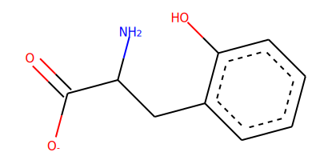 </td><td>2-hydroxy-phenylalanine.params</td><td><code>N[C@@H](Cc1ccccc1O)C(=O)[O-]</code></td></tr>
<tr><td> Error </td><td> X </td><td> S56.params </td><td> (MolSanitizeException)  Explicit valence for atom # 5 C, 5, is greater than permitted </td></tr>
<tr><td style=>C93</td><td>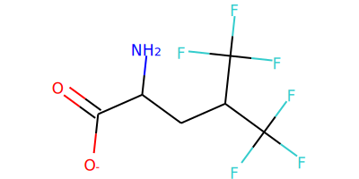 </td><td>hexafluoro-leucine.params</td><td><code>N[C@@H](CC(C(F)(F)F)C(F)(F)F)C(=O)[O-]</code></td></tr>
<tr><td style=>C20</td><td>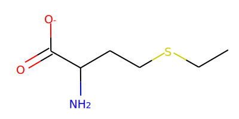 </td><td>ethionine.params</td><td><code>CCSCC[C@H](N)C(=O)[O-]</code></td></tr>
<tr><td style=>B74</td><td>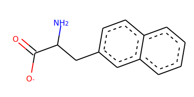 </td><td>beta-(2-naphthyl)-alanine.params</td><td><code>N[C@@H](Cc1ccc2ccccc2c1)C(=O)[O-]</code></td></tr>
<tr><td style=>C55</td><td>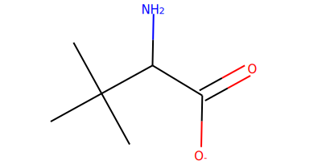 </td><td>tert-butyl-glycine.params</td><td><code>CC(C)(C)[C@H](N)C(=O)[O-]</code></td></tr>
<tr><td style=>B44</td><td>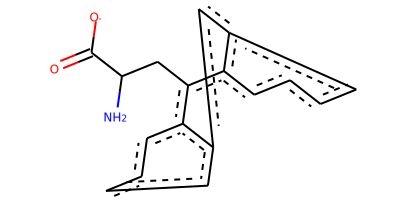 </td><td>9-anthryl-alanine.params</td><td><code>N[C@@H](Cc1c2ccccc2cc2ccccc12)C(=O)[O-]</code></td></tr>
<tr><td> Error </td><td> X </td><td> 6-chloro-tryptophan.params </td><td> (MolSanitizeException)  Explicit valence for atom # 5 C, 5, is greater than permitted </td></tr>
<tr><td style=>C92</td><td> </td><td>fluoro-leucine_ent2.params</td><td><code>CC(CF)C[C@H](N)C(=O)[O-]</code></td></tr>
<tr><td style=>B62</td><td>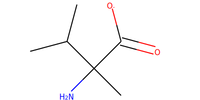 </td><td>alpha-methyl-valine.params</td><td><code>CCC.C[C@H](N)C(=O)[O-]</code></td></tr>
<tr><td style=>C41</td><td>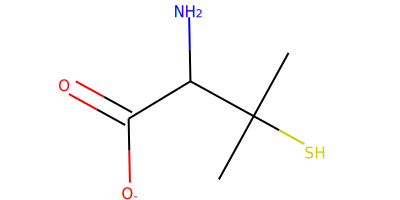 </td><td>penicillamine.params</td><td><code>CC(C)(S)[C@H](N)C(=O)[O-]</code></td></tr>
<tr><td style=>ABA</td><td>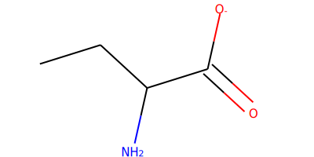 </td><td>ABA.params</td><td><code>CC[C@H](N)C(=O)[O-]</code></td></tr>
<tr><td> Error </td><td> X </td><td> 4-phenyl-phenylalanine_tyr_rot.params </td><td> (MolSanitizeException)  Explicit valence for atom # 10 C, 5, is greater than permitted </td></tr>
<tr><td style=>A98</td><td>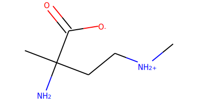 </td><td>4-amino-piperidine-4-carboxylic-acid.params</td><td><code>CC[NH2+]CC[C@H](N)C(=O)[O-]</code></td></tr>
<tr><td style=>A83</td><td>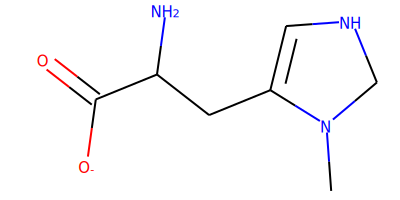 </td><td>3-methyl-histidine_prot.params</td><td><code>CN1CNC=C1C[C@H](N)C(=O)[O-]</code></td></tr>
<tr><td style=>B59</td><td>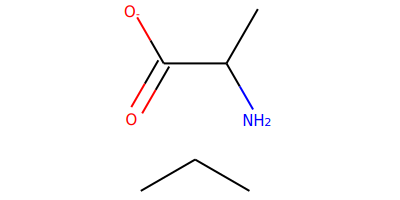 </td><td>alpha-methyl-proline.params</td><td><code>CCC.C[C@H](N)C(=O)[O-]</code></td></tr>
<tr><td style=>B56</td><td>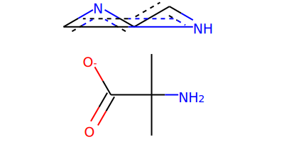 </td><td>alpha-methyl-histidine.params</td><td><code>C[C@H](N)C(=O)[O-].Cc1c[nH]cn1</code></td></tr>
<tr><td style=>A45</td><td>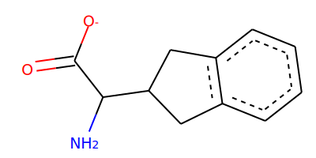 </td><td>2-indanyl-glycine_puck2.params</td><td><code>N[C@H](C(=O)[O-])C1Cc2ccccc2C1</code></td></tr>
<tr><td> Error </td><td> X </td><td> MPH.params </td><td> (RuntimeError)    File: /Volumes/MacintoshHD3/benchmark/W.fujii.release/rosetta.Fujii.release/_commits_/main/source/src/core/conformation/Residue.cc:1365 [ ERROR ] UtilityExitException ERROR: Unable to fill in missing atoms.   </td></tr>
<tr><td> Error </td><td> X </td><td> diphenylglycine.params </td><td> (KekulizeException)  Can't kekulize mol.  Unkekulized atoms: 0 1 2 3 4  </td></tr>
<tr><td> Error </td><td> X </td><td> 6-methyl-tryptophan.params </td><td> (MolSanitizeException)  Explicit valence for atom # 5 C, 5, is greater than permitted </td></tr>
<tr><td> Error </td><td> X </td><td> 6-bromo-tryptophan.params </td><td> (MolSanitizeException)  Explicit valence for atom # 5 C, 5, is greater than permitted </td></tr>
<tr><td style=>BB8</td><td>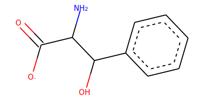 </td><td>phenyl-serine.params</td><td><code>N[C@H](C(=O)[O-])C(O)c1ccccc1</code></td></tr>
<tr><td> Error </td><td> X </td><td> 7-azatryptophan.params </td><td> (MolSanitizeException)  Explicit valence for atom # 5 C, 5, is greater than permitted </td></tr>
<tr><td style=>C54</td><td>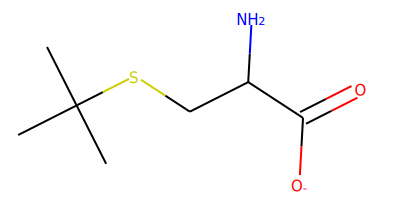 </td><td>tert-butyl-cysteine.params</td><td><code>CC(C)(C)SC[C@H](N)C(=O)[O-]</code></td></tr>
<tr><td> Error </td><td> X </td><td> V03.params </td><td> (KekulizeException)  Can't kekulize mol.  Unkekulized atoms: 0 1 3 4 6  </td></tr>
<tr><td style=>MPA</td><td>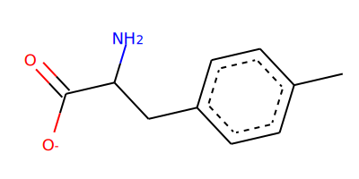 </td><td>MPA.params</td><td><code>Cc1ccc(C[C@H](N)C(=O)[O-])cc1</code></td></tr>
<tr><td style=>TES</td><td> </td><td>TES.params</td><td><code>CC(=O)NC1C(NC(=O)C[C@H](N)C(=O)[O-])OC(CO)C(OC2OC(CO)C(OC3OC(COC4OC(COC5OC(CO)C(O)C(O)C5O)C(O)C(OC5OC(CO)C(O)C(O)C5O)C4O)C(O)C(OC4OC(CO)C(O)C(O)C4O)C3O)C(O)C2NC(C)=O)C1O</code></td></tr>
<tr><td style=>C89</td><td> </td><td>4-fluoro-proline_puck.params</td><td><code>CC(F)C[C@H](N)C(=O)[O-]</code></td></tr>
<tr><td style=>C53</td><td>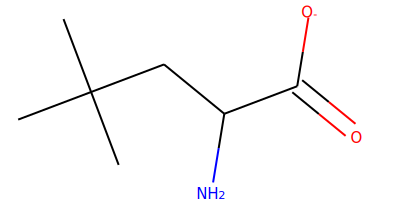 </td><td>tert-butyl-alanine.params</td><td><code>CC(C)(C)C[C@H](N)C(=O)[O-]</code></td></tr>
<tr><td style=>A06</td><td>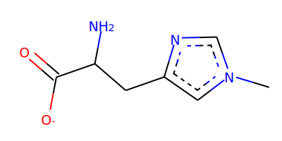 </td><td>1-methyl-histidine.params</td><td><code>Cn1cnc(C[C@H](N)C(=O)[O-])c1</code></td></tr>
<tr><td style=>A69</td><td>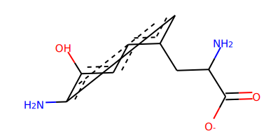 </td><td>3-amino-tyrosine.params</td><td><code>Nc1cc(C[C@H](N)C(=O)[O-])ccc1O</code></td></tr>
<tr><td style=>HTY</td><td>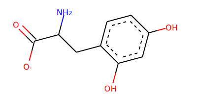 </td><td>HTY.params</td><td><code>N[C@@H](Cc1ccc(O)cc1O)C(=O)[O-]</code></td></tr>
<tr><td style=>B02</td><td> </td><td>4-amino-tetrahydropyran-4-carboxylic_acid.params</td><td><code>CCOCC[C@H](N)C(=O)[O-]</code></td></tr>
<tr><td> Error </td><td> X </td><td> alpha-methyl-tryptophan.params </td><td> (MolSanitizeException)  Explicit valence for atom # 6 C, 5, is greater than permitted </td></tr>
<tr><td style=>HPR</td><td> </td><td>HPR.params</td><td><code>CC(O)C[C@H](N)C(=O)[O-]</code></td></tr>
<tr><td> Error </td><td> X </td><td> 4-methyl-tryptophan.params </td><td> (MolSanitizeException)  Explicit valence for atom # 5 C, 5, is greater than permitted </td></tr>
<tr><td style=>C60</td><td> </td><td>trifluoro-alanine.params</td><td><code>N[C@H](C(=O)[O-])C(F)(F)F</code></td></tr>
<tr><td style=>C01</td><td> </td><td>beta-cyclopentyl-alanine.params</td><td><code>N[C@@H](CC1CCCC1)C(=O)[O-]</code></td></tr>
<tr><td style=>A12</td><td> </td><td>2.4-dimethyl-phenylalanine.params</td><td><code>Cc1ccc(C[C@H](N)C(=O)[O-])c(C)c1</code></td></tr>
<tr><td style=>A07</td><td> </td><td>1-methyl-histidine_prot.params</td><td><code>CN1C=C(C[C@H](N)C(=O)[O-])NC1</code></td></tr>
<tr><td> Error </td><td> X </td><td> MTP.params </td><td> (MolSanitizeException)  Explicit valence for atom # 5 C, 5, is greater than permitted </td></tr>
<tr><td style=>A68</td><td> </td><td>3-aminomethyl-phenylalanine.params</td><td><code>N[C@@H](Cc1cccc(C[NH3+])c1)C(=O)[O-]</code></td></tr>
<tr><td style=>V01</td><td> </td><td>V01.params</td><td><code>N[C@H](C(=O)[O-])C(O)c1ccc(O)c(Cl)c1</code></td></tr>
<tr><td style=>C12</td><td> </td><td>cyclohexyl-glycine.params</td><td><code>N[C@H](C(=O)[O-])C1CCCCC1</code></td></tr>
<tr><td style=>A84</td><td> </td><td>3-methyl-phenylalanine.params</td><td><code>Cc1cccc(C[C@H](N)C(=O)[O-])c1</code></td></tr>
<tr><td style=>C61</td><td> </td><td>trifluoro-leucine.params</td><td><code>CC(C[C@H](N)C(=O)[O-])C(F)(F)F</code></td></tr>
<tr><td style=>BCS</td><td> </td><td>BCS.params</td><td><code>N[C@@H](CSCc1ccccc1)C(=O)[O-]</code></td></tr>
<tr><td style=>A78</td><td> </td><td>3-hydroxy-phenylalanine.params</td><td><code>N[C@@H](Cc1cccc(O)c1)C(=O)[O-]</code></td></tr>
<tr><td style=>C95</td><td> </td><td>3-chloro-phenylalanine.params</td><td><code>N[C@@H](Cc1cccc(Cl)c1)C(=O)[O-]</code></td></tr>
<tr><td style=>A91</td><td> </td><td>4.5-dehydro-leucine.params</td><td><code>C=C(C)C[C@H](N)C(=O)[O-]</code></td></tr>
<tr><td> Error </td><td> X </td><td> alpha-aminoadipic_acid.params </td><td> (MolSanitizeException)  Explicit valence for atom # 7 C, 5, is greater than permitted </td></tr>
<tr><td> Error </td><td> X </td><td> 7-bromo-tryptophan.params </td><td> (MolSanitizeException)  Explicit valence for atom # 5 C, 5, is greater than permitted </td></tr>
<tr><td style=>B63</td><td> </td><td>amino-ethyl-cysteine.params</td><td><code>N[C@@H](CSCC[NH3+])C(=O)[O-]</code></td></tr>
<tr><td style=>B19</td><td> </td><td>4-fluoro-proline.params</td><td><code>CC(F)C[C@H](N)C(=O)[O-]</code></td></tr>
<tr><td style=>C03</td><td> </td><td>beta-fluoro-alanine.params</td><td><code>N[C@@H](CF)C(=O)[O-]</code></td></tr>
<tr><td style=>C91</td><td> </td><td>fluoro-leucine_ent1.params</td><td><code>CC(CF)C[C@H](N)C(=O)[O-]</code></td></tr>
<tr><td style=>A94</td><td> </td><td>4-aminomethyl-phenylalanine.params</td><td><code>N[C@@H](Cc1ccc(C[NH3+])cc1)C(=O)[O-]</code></td></tr>
<tr><td style=>ORN</td><td> </td><td>ornithine.params</td><td><code>N[C@@H](CCC[NH2+])C(=O)[O-]</code></td></tr>
<tr><td> Error </td><td> X </td><td> 5-methyl-tryptophan.params </td><td> (MolSanitizeException)  Explicit valence for atom # 5 C, 5, is greater than permitted </td></tr>
<tr><td> Error </td><td> X </td><td> 5-chloro-tryptophan.params </td><td> (MolSanitizeException)  Explicit valence for atom # 5 C, 5, is greater than permitted </td></tr>
<tr><td> Error </td><td> X </td><td> HP2.params </td><td> (ValueError)  causes seg fault </td></tr>
<tr><td> Error </td><td> X </td><td> 4-phenyl-phenylalanine.params </td><td> (MolSanitizeException)  Explicit valence for atom # 10 C, 5, is greater than permitted </td></tr>
<tr><td> Error </td><td> X </td><td> 4-hydroxy-phenylglycine.params </td><td> (KekulizeException)  Can't kekulize mol.  Unkekulized atoms: 0 1 2 4 5  </td></tr>
<tr><td style=>DPP</td><td> </td><td>2.3-diaminopropionic_acid.params</td><td><code>N[C@@H](C[NH3+])C(=O)[O-]</code></td></tr>
<tr><td style=>IGL</td><td> </td><td>2-indanyl-glycine_puck1.params</td><td><code>N[C@H](C(=O)[O-])C1Cc2ccccc2C1</code></td></tr>
<tr><td style=>C05</td><td> </td><td>beta-iodo-alanine.params</td><td><code>N[C@@H](CI)C(=O)[O-]</code></td></tr>
<tr><td style=>A04</td><td> </td><td>1-amino-cyclopentane-carboxylic_acid.params</td><td><code>CCCC[C@H](N)C(=O)[O-]</code></td></tr>
<tr><td style=>A92</td><td> </td><td>4.5-dehydro-lysine.params</td><td><code>N[C@@H](CC=CC[NH3+])C(=O)[O-]</code></td></tr>
<tr><td style=>A48</td><td> </td><td>2-methyl-phenylalanine.params</td><td><code>Cc1ccccc1C[C@H](N)C(=O)[O-]</code></td></tr>
<tr><td> Error </td><td> X </td><td> SAL.params </td><td> (RuntimeError)    File: /Volumes/MacintoshHD3/benchmark/W.fujii.release/rosetta.Fujii.release/_commits_/main/source/src/core/conformation/Residue.cc:200 [ ERROR ] UtilityExitException ERROR:    </td></tr>
<tr><td style=>B67</td><td> </td><td>beta-(1-naphthyl)-alanine.params</td><td><code>N[C@@H](Cc1cccc2ccccc12)C(=O)[O-]</code></td></tr>
<tr><td> Error </td><td> X </td><td> phenylglycine.params </td><td> (KekulizeException)  Can't kekulize mol.  Unkekulized atoms: 0 1 2 3 4  </td></tr>
<tr><td style=>B31</td><td> </td><td>4-tert-butyl-phenylalanine.params</td><td><code>CC(C)(C)c1ccc(C[C@H](N)C(=O)[O-])cc1</code></td></tr>
<tr><td style=>APA</td><td> </td><td>APA.params</td><td><code>Nc1ccc(C[C@H](N)C(=O)[O-])cc1</code></td></tr>
<tr><td> Error </td><td> X </td><td> 6-fluoro-tryptophan.params </td><td> (MolSanitizeException)  Explicit valence for atom # 5 C, 5, is greater than permitted </td></tr>
<tr><td> Error </td><td> X </td><td> 4-carboxy-phenylalanine.params </td><td> (MolSanitizeException)  Explicit valence for atom # 10 C, 5, is greater than permitted </td></tr>
<tr><td> Error </td><td> X </td><td> BZP.params </td><td> (MolSanitizeException)  Explicit valence for atom # 10 C, 5, is greater than permitted </td></tr>
<tr><td> Error </td><td> X </td><td> n-in-methyl-tryptophan.params </td><td> (MolSanitizeException)  Explicit valence for atom # 5 C, 5, is greater than permitted </td></tr>
<tr><td style=>C16</td><td> </td><td>dipropyl-glycine.params</td><td><code>CCC.CCC[C@H](N)C(=O)[O-]</code></td></tr>
</tbody>
</table>